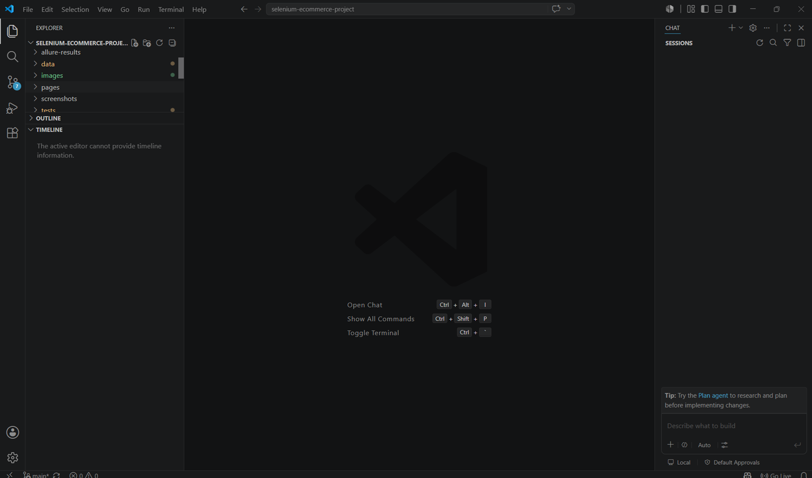
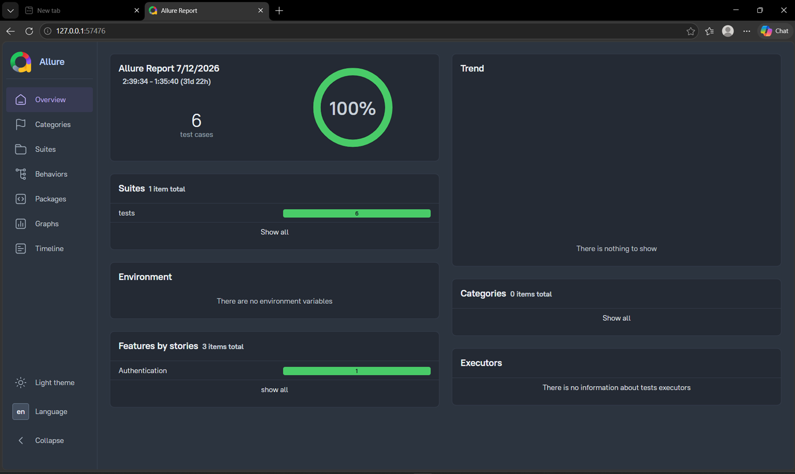
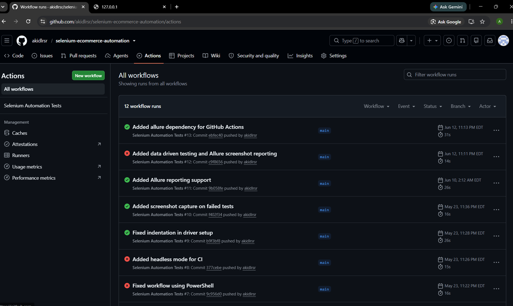

# 🛒 Selenium E-Commerce Automation Framework


---

# 📌 Project Overview

This project is a Selenium-based UI Automation Framework developed using **Python** and **PyTest** following industry best practices.

The framework automates end-to-end test scenarios for the **SauceDemo** e-commerce website while demonstrating a scalable automation framework using the **Page Object Model (POM)** design pattern.

It also integrates **Allure Reports**, **GitHub Actions CI/CD**, automatic **failure screenshots**, logging, and **data-driven testing** to simulate an enterprise-level automation framework.

---

# 🚀 Technologies Used

- Python
- Selenium WebDriver
- PyTest
- Allure Reports
- GitHub Actions
- Page Object Model (POM)
- Git
- GitHub

---

# 📁 Project Structure

```
selenium-ecommerce-project
│
├── .github
│   └── workflows
│       └── selenium-tests.yml
│
├── data
│   └── test_data.py
│
├── pages
│   ├── cart_page.py
│   └── login_page.py
│
├── tests
│   ├── conftest.py
│   ├── test_cart.py
│   └── test_login.py
│
├── utils
│   ├── driver_setup.py
│   └── logger.py
│
├── images
│   ├── allure-dashboard.png
│   ├── github-actions.png
│   └── folder-structure.png
│
├── requirements.txt
├── README.md
└── .gitignore
```

### Folder Structure Screenshot



---

# ✅ Framework Features

- ✅ Selenium WebDriver Automation
- ✅ PyTest Framework
- ✅ Page Object Model (POM)
- ✅ Data-Driven Testing
- ✅ Logging
- ✅ Screenshot Capture on Failure
- ✅ Allure Reporting
- ✅ GitHub Actions Continuous Integration
- ✅ Automated Test Execution

---

# 🧪 Automated Test Scenarios

Current automated test coverage includes:

- Successful Login
- Locked Out User Login
- Invalid Login
- Empty Username / Password
- Add Product to Cart

---

# 🏗 Framework Architecture

```
                GitHub Actions
                       │
                       ▼
                 Execute PyTest
                       │
                       ▼
             Selenium WebDriver
                       │
                       ▼
             SauceDemo Web Application
                       │
          ┌────────────┴────────────┐
          ▼                         ▼
   Allure Reports           Screenshot on Failure
```

---

# ▶️ Running the Project

## Install Dependencies

```bash
pip install -r requirements.txt
```

## Run All Tests

```bash
pytest
```

## Generate Allure Results

```bash
pytest --alluredir=allure-results
```

## Open Allure Report

```bash
allure serve allure-results
```

---

# 📊 Allure Reporting

The framework integrates **Allure Reports** to provide:

- Detailed execution summary
- Pass / Fail statistics
- Execution timeline
- Automatic failure screenshots
- Test logs

### Sample Allure Report



---

# ⚙️ Continuous Integration (CI/CD)

GitHub Actions automatically executes the test suite every time code is pushed to the repository.

This ensures that every change is validated through automated testing before future development continues.

### GitHub Actions Workflow



---

# 📈 Future Enhancements

Planned improvements include:

- Excel Data-Driven Testing
- Parallel Test Execution (pytest-xdist)
- API Automation Framework
- Docker Integration
- Jenkins CI/CD Pipeline
- Playwright Automation Framework
- Cross-browser Testing

---

# 👨‍💻 Author

**Aki Del Rosario**

Automation framework created as part of my QA Automation portfolio to demonstrate modern test automation practices including Selenium, PyTest, Allure Reporting, and CI/CD with GitHub Actions.

---

# ⭐ If you found this project useful

Feel free to ⭐ star this repository!